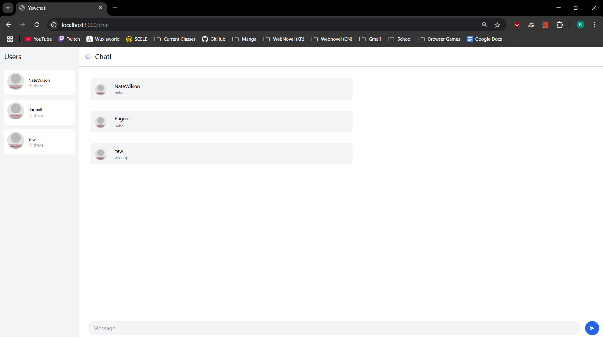

# Reflection Modul 10
Ragnall Muhammad Al Fath
2306210550 / AdPro B
---

### 1. Original Code

### 2. Be Creative!

In this enhanced version of YewChat, I've implemented a dynamic theme system with Light, Dark, Ocean, and Forest variants, allowing users to personalize their chat experience. The interface now features an intuitive message grouping mechanism that visually connects consecutive messages from the same user while displaying avatars only for the first message in each group. I've also added an emoji picker with 32 popular emojis that can be accessed via a dedicated button, enabling users to easily add expressions to their messages. Additionally, the app now supports message reactions, allowing users to respond to messages with emoji reactions like 👍, ❤️, and 😂, with a counter tracking how many times each reaction has been used, creating a more interactive and engaging chat experience.